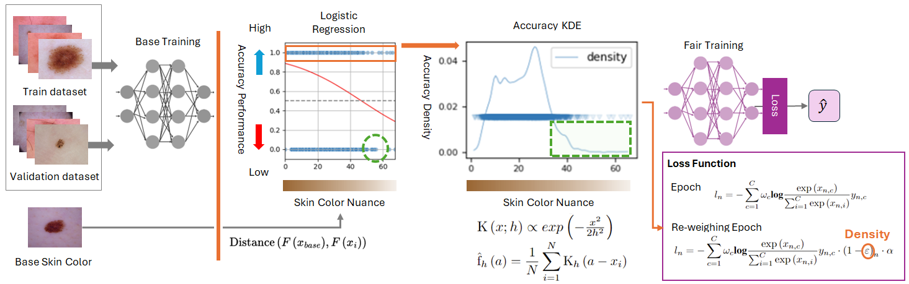

# Individual Fairness for Skin Colour

## Abstract
Skin colour has historically been a focal point of discrimination in society. To address this unfairness, the discourse on skin colour fairness in machine learning has predominantly centred on comparative analyses of fairness across subgroups rather than on the actual skin colour of individuals. Exposing discrimination that targets specific subgroups is necessary to correct them, but those approaches may inadvertently perpetuate further unfairness, particularly for individuals who are outliers within these subgroups. In response to this gap, our study introduces a novel technique to evaluate the accuracy performance of ultimate individual fairness by utilising kernel density estimation and to mitigate using a re-weighting loss function. Furthermore, we conducted a comprehensive comparison of statistical distance functions to quantify disparities between continuous distributions of skin tone. The findings of this research indicate a correlation between skin colour distance and accuracy performance, thereby highlighting the most suitable distance metrics for the measurement of skin colour. This manuscript contributes to the advancement of individual fairness in relation to skin colour by identifying biases that conventional methodologies have failed to capture.

## Distance functions to measure skin colour nuance

| Distance Metrics               | Summary | Equation |
|--------------------------------|---------|----------|
| Wasserstein Distance           |         |          |
| Wasserstein Distance with Sign |         |          |
| Kuiper Distance                |         |          |
| Kolmogorov–Smirnov metric      |         |　        |
| Cramér–von Mises distance      |         |          |
| Anderson–Darling distance      |         |          |
| Energy distance                |         |          |
| Kruglov distance               |         |          |
| Harmonic mean similarity       |         |          |
| Fidelity similarity            |         |          |
| Hellinger metric               |         |          |
| Patrick–Fisher distance        |         |          |

## Reference
Deza, Elena, et al. Encyclopedia of distances. Springer Berlin Heidelberg, 2009.
